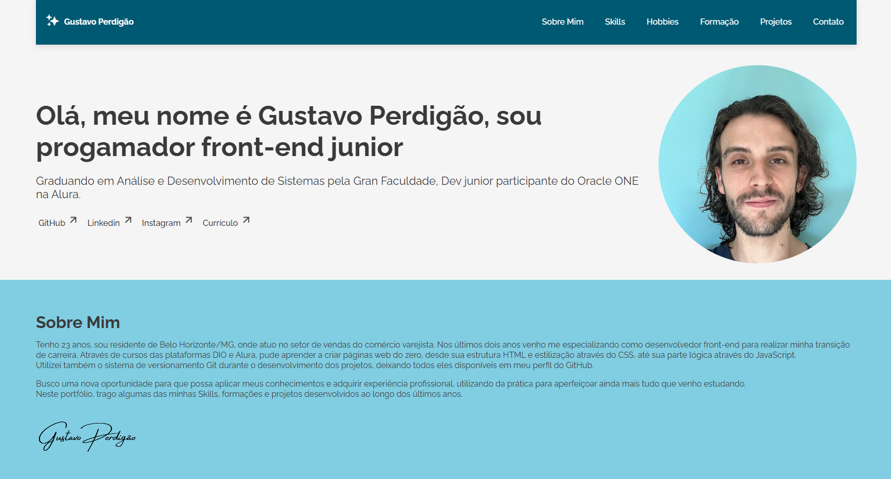
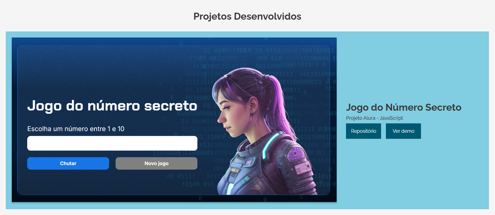
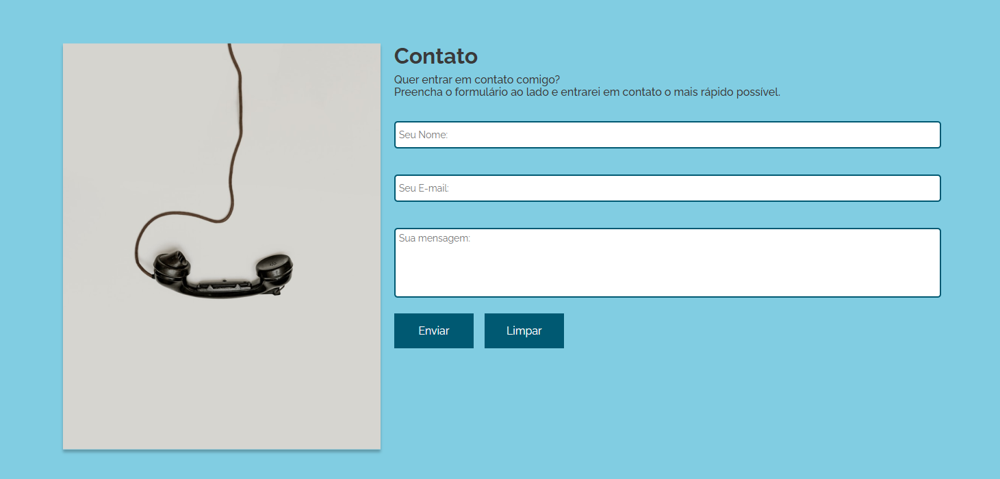

# Portfolio Profissional - Gustavo Perdigão   

  

Bem-vindo ao meu portfólio profissional! Este projeto foi desenvolvido com foco em **responsividade**, **acessibilidade** e **excelência visual** para apresentar minhas habilidades e experiências de forma única e impactante.

---

## 🌟 **Destaques do Projeto**
- **Seções Bem-Definidas**:
  - **Sobre Mim**: Minha trajetória e objetivos.
  - **Hard Skills**: Tecnologias e ferramentas que domino.
  - **Projetos**: Lista de projetos com links interativos.
  - **Contato**: Um formulário funcional e direto.
    
- **Design Responsivo**: Totalmente adaptado para qualquer dispositivo, seja desktop, tablet ou smartphone.
  
- **Formulário de Contato com API**: Utiliza uma API para envio de mensagens de forma rápida e segura.
  
- **Acessibilidade Visual**: Uso de cores, fontes e contrastes adequados.
  
---

## 🛠️ **Tecnologias Utilizadas**

 
 

- **HTML5**: Estrutura semântica e moderna para acessibilidade.
- **CSS3**: Estilização responsiva e atraente, alinhada às melhores práticas.
- **FormSubmit API**: Integração para envio de mensagens do formulário.
- **Git**: Controle de versão e colaboração.

---

## Conheça o projeto:

### 🖥️ Tela Inicial

- Na tela inical, temos o cabeçalho com a barra de navegação interativa, basta clicar na seção desejada que a página irá te direcionar até ela. Além dessa funcionalidade, temos a parte de apresentação com os links das minhas redes sociais para que vocês conheçam um pouco mais sobre mim.

### ✍️ Seção Projetos

- Cada projeto carregado à página possui dois botões, um que direciona o usuário para o repósitorio do projeto no GitHub e outro para a Demo do projeto no Vercel, assim, o usuário pode conhecer as funcionalidades da aplicação desenvolvida de maneira fácil e rápida.

### 📞 Formulário de Contato

- Este formulário está integrado ao FormSubmit, o usuário pode entrar em contato comigo através dele, basta preencher os dados solicitados e então enviar sua mensagem!
- O formulário possui checagem de preenchimento dos campos, para evitar que seja enviado sem estar preenchido.

---

## 🚀 **Como Acessar o Projeto**

### Online
O projeto está carregado no Vercel, facilitando o acesso.  
Clique [aqui](https://challenge-portfolio-alura-ueh3.vercel.app/) para testar!

---

⭐ Deixe sua Estrela!  
Challenge Alura (Oracle One) - Portfólio   
Feito por [Gustavo Perdigão](https://github.com/pgustavo23).

